# Introduction to Machine Learning and Data mining

This is an Introduction to Machine Learning in R, in which you'll learn the basics of unsupervised learning for pattern recognition and supervised learning for prediction. At the end of this workshop, we hope that you will:
- appreciate the importance of performing exploratory data analysis (or EDA) before starting to model your data.
- understand the basics of unsupervised learning and know the examples of principal component analysis (PCA) and k-means clustering.
- understand the basics of supervised learning for prediction and the differences between classification and regression.
- understand modern machine learning techniques and principles, such as test train split, k-fold cross validation and regularization.
- be able to write code to implement the above techniques and methodologies using `R`, `caret` and `glmnet`.

We will not be focusing on the mathematical foundation for each of the methods and approaches we'll be discussing. There are many resources that can provide this context, but for the purposes of this workshop we believe that they are beyond the scope.

_**Note**_: All material here has been adapted from the course material for the Machine Learning course at SIB (22-23/07/2020) 

## Machine Learning basic concepts

Machine Learning (ML) is a subset of Artificial Intelligence (AI) in the field of computer science that often uses statistical techniques to give computers the ability to “learn” (i.e., progressively improve performance on a specific task) with data, without being explicitly programmed.

Machine Learning is often closely related, if not used as an alternate term, to fields like Data Mining (the process of discovering patterns in large data sets involving methods at the intersection of machine learning, statistics, and database systems), Pattern Recognition, Statistical Inference or Statistical Learning. All these areas often employ the same methods and perhaps the name changes based on the practitioner’s expertise or the application domain.


## Taxonomy of ML and examples of algorithms

The main ML tasks are typically classified into two broad categories, depending on whether there is "feedback" or a "teacher" available to the learning system or not.

- **Supervised Learning**: The system is presented with example inputs and their desired outputs provided by the “teacher” and the goal of the machine learning algorithm is to create a mapping from the inputs to the outputs. The mapping can be thought of as a function that if it is given as an input one of the training samples it should output the desired value.
- **Unsupervised Learning**: In the unsupervised learning case, the machine learning algorithm is not given any examples of desired output, and is left on its own to find structure in its input.

The main machine learning tasks are separated based on what the system tries to accomplish in the end:
- **Dimensionality Reduction**: simplifies inputs by mapping them into a lower-dimensional space. Topic modeling is a related problem, where a program is given a list of human language documents and is tasked with finding out which documents cover similar topics.
- **Clustering**: a set of inputs is to be divided into groups. Unlike in classification, the groups
are not known beforehand, making this typically an unsupervised task.
- **Classification**: inputs are divided into two or more classes, and the learner must produce a model that assigns unseen inputs to one or more (multi-label classification) of these classes. This is typically tackled in a supervised manner. Identification of patient vs cases is an example of classification, where the inputs are gene expression and/or clinical profiles and the classes are "patient" and "healthy".
- **Regression**: also a supervised problem, the outputs are continuous rather than discrete.
- **Association Rules learning** (or dependency modelling): Searches for relationships between inputs. For example, a supermarket might gather data on customer purchasing habits. Using association rule learning, the supermarket can determine which products are frequently bought together and use this information for marketing purposes. This is sometimes referred to as market basket analysis.

## Overview of Deep learning

Deep learning is a recent trend in machine learning that models highly non-linear representations of data. In the past years, deep learning has gained a tremendous momentum and prevalence for a variety of applications. Among these are image and speech recognition, driverless cars, natural language processing and many more. Interestingly, the majority of mathematical concepts for deep learning have been known for decades. However, it is only through several recent developments that the full potential of deep learning has been unleashed. The success of deep learning has led to a wide range of frameworks and libraries for various programming languages. Examples include `Caffee`, `Theano`, `Torch` and `TensorFlow`, amongst others.

The R programming language has gained considerable popularity among statisticians and data miners for its ease-of-use, as well as its sophisticated visualizations and analyses. With the advent of the deep learning era, the support for deep learning in R has grown ever since, with an increasing number of packages becoming available. This section presents an overview on deep learning in R as provided by the following packages: `MXNetR`, `darch`, `deepnet`, `H2O` and `deepr`. It's important noting that the underlying learning algorithms greatly vary from one package to another. As such, the following table shows a list of the available methods/architectures in each of the packages.

| Package | Available architectures of neural networks |
|---------|--------------------------------------------|
| MXNetR | Feed-forward neural network, convolutional neural network (CNN) |
| darch | Restricted Boltzmann machine, deep belief network |
| deepnet | Feed-forward neural network, restricted Boltzmann machine, deep belief network, stacked autoencoders |
| H2O | Feed-forward neural network, deep autoencoders |
| deepr | Simplify some functions from H2O and deepnet packages |


## Applications of ML in Bioinformatics

There are several biological domains where machine learning techniques are applied for knowledge extraction from data. The following figure (retrieved from [Pedro Larrañaga et.al, Briefings in Bioinformatics 7:1, 2006](https://doi.org/10.1093/bib/bbk007)) shows a scheme of the main biological problems where computational methods are being applied.

")

> ###  Tip: Examples of different Machine Learning / Data Mining techniques that can be applied to different NGS data analysis pipelines.
> An extensive list of examples of applications of Machine Learning in Bioinformatics can be found in the 
{: .tip}

## How to choose the right Machine Learning technique?

Tip 4 in the "Ten quick tips for machine learning in computational biology" () provides a nice overview of what one should keep in mind, when choosing the right Machine Learning technique in Bioinformatics.

> **Which algorithm should you choose to start? In short; The simplest one!**
>
> Once you understand what kind of biological problem you are trying to solve, and which method category can fit your situation, you then have to choose the machine learning algorithm with which to start your project. Even if it always advisable to use multiple techniques and compare their results, the decision on which one to start can be tricky.
>
> Many textbooks suggest to select a machine learning method by just taking into account the problem representation, while Pedro Domingos ("A few useful things to know about machine learning", Commun ACM. 2012; 55(10):78–87) suggests to take into account also the cost evaluation, and the performance optimization.
>
> This algorithm-selection step, which usually occurs at the beginning of a machine learning journey, can be dangerous for beginners. In fact, an inexperienced practitioner might end up choosing a complicated, inappropriate data mining method which might lead him/her to bad results, as well as to lose precious time and energy. Therefore, this is our tip for the algorithm selection: if undecided, start with the simplest algorithm (Hand DJ, "Classifier technology and the illusion of progress". Stat Sci. 2006; 21(1):1–14).
>
> By employing a simple algorithm, you will be able to keep everything under control, and better understand what is happening during the application of the method. In addition, a simple algorithm will provide better generalization skills, less chance of overfitting, easier training and faster learning properties than complex methods. As David J. Hand explained, complex models should be employed only if the dataset features provide some reasonable justification for their usage.
>
> (from )
{: .quote}


# Exploratory Data Analysis (EDA) and Unsupervised Learning

Before diving in the tutorial, we need to open RStudio. If you do not know how or never interacted with RStudio, please follow the [dedicated tutorial]().



## Loading and exploring data

The data that we will be using for this workshop are from the following sources:

- The [Breast Cancer Wisconsin (Diagnostic) Data Set](http://archive.ics.uci.edu/ml/datasets/breast+cancer+wisconsin+%28diagnostic%29) from the [UCI Machine Learning repository](http://archive.ics.uci.edu/ml/).
- RNA-Seq data from the study of tooth growth in mouse embryos from the [Gene Expression Omnibus ID:GSE76316](https://www.ncbi.nlm.nih.gov/geo/query/acc.cgi?acc=GSE76316)

We will first load up the UCI dataset. The dataset itself does not contain column names, we've created a second file with only the column names, which we will use.
We will be using [tidyverse](https://www.tidyverse.org), a collection of R packages for Data Science.

> ###  Hands-on: Load the UCI Dataset
>
> 1. Load the data
>
>    ```r
>    library(tidyverse) # working with data frames, plotting
>
>    breastCancerData <- read_csv("https://archive.ics.uci.edu/ml/machine-learning-databases/breast-cancer-wisconsin/wdbc.data",
>                   col_names = FALSE)
>
>    breastCancerDataColNames <- read_csv("https://raw.githubusercontent.com/fpsom/2020-07-machine-learning-sib/master/data/wdbc.colnames.csv",
>                                         col_names = FALSE)
>
>    colnames(breastCancerData) <- breastCancerDataColNames$X1
>    ```
>
> 2. If all goes well, we can see that our dataset contains 569 observations across 32 variables. This is what the first 6 lines look like:
>
>    ```
>    # Check out head of dataframe
>    breastCancerData %>% head()
>
>    # A tibble: 6 x 32
>          ID Diagnosis Radius.Mean Texture.Mean Perimeter.Mean Area.Mean Smoothness.Mean
>       <dbl> <chr>           <dbl>        <dbl>          <dbl>     <dbl>           <dbl>
>    1 8.42e5 M                18.0         10.4          123.      1001           0.118
>    2 8.43e5 M                20.6         17.8          133.      1326           0.0847
>    3 8.43e7 M                19.7         21.2          130       1203           0.110
>    4 8.43e7 M                11.4         20.4           77.6      386.          0.142
>    5 8.44e7 M                20.3         14.3          135.      1297           0.100
>    6 8.44e5 M                12.4         15.7           82.6      477.          0.128
>    # ... with 25 more variables: Compactness.Mean <dbl>, Concavity.Mean <dbl>,
>    #   Concave.Points.Mean <dbl>, Symmetry.Mean <dbl>, Fractal.Dimension.Mean <dbl>,
>    #   Radius.SE <dbl>, Texture.SE <dbl>, Perimeter.SE <dbl>, Area.SE <dbl>,
>    #   Smoothness.SE <dbl>, Compactness.SE <dbl>, Concavity.SE <dbl>, Concave.Points.SE <dbl>,
>    #   Symmetry.SE <dbl>, Fractal.Dimension.SE <dbl>, Radius.Worst <dbl>, Texture.Worst <dbl>,
>    #   Perimeter.Worst <dbl>, Area.Worst <dbl>, Smoothness.Worst <dbl>,
>    #   Compactness.Worst <dbl>, Concavity.Worst <dbl>, Concave.Points.Worst <dbl>,
>    #   Symmetry.Worst <dbl>, Fractal.Dimension.Worst <dbl>
>    ```
>
> 3. We will also make our `Diagnosis` column a factor:
>
>    ```r
>    # Make Diagnosis a factor
>    breastCancerData$Diagnosis <- as.factor(breastCancerData$Diagnosis)
>    ```
>
>    > ###  Question
>    >
>    > What is a factor?
>    >
>    > > ###  Solution
>    > >
>    > > TODO
>    > >
>    > {: .solution}
>    {: .question}
>
{: .hands_on}

## What is Exploratory Data Analysis (EDA) and why is it useful?

Before thinking about modeling, have a look at your data. There is no point in throwing a 10000 layer convolutional neural network (whatever that means) at your data before you even know what you're dealing with.

We will first remove the first column, which is the unique identifier of each row:

> ###  Question
>
> Why?
>
> > ###  Solution
> >
> > TODO
> >
> {: .solution}
{: .question}

> ###  Hands-on: Exploratory Data Analysis
> 1. Remove the first column
>
>    ```r
>    # Remove first column
>    breastCancerDataNoID <- breastCancerData[2:ncol(breastCancerData)]
>    ```
>
> 2. View the dataset. The output should like like this:
>
>    ```
>    # View head
>    breastCancerDataNoID %>% head()
>
>    # A tibble: 6 x 31
>      Diagnosis Radius.Mean Texture.Mean Perimeter.Mean Area.Mean Smoothness.Mean
>      <fct>           <dbl>        <dbl>          <dbl>     <dbl>           <dbl>
>    1 M                18.0         10.4          123.      1001           0.118
>    2 M                20.6         17.8          133.      1326           0.0847
>    3 M                19.7         21.2          130       1203           0.110
>    4 M                11.4         20.4           77.6      386.          0.142
>    5 M                20.3         14.3          135.      1297           0.100
>    6 M                12.4         15.7           82.6      477.          0.128
>    # ... with 25 more variables: Compactness.Mean <dbl>, Concavity.Mean <dbl>,
>    #   Concave.Points.Mean <dbl>, Symmetry.Mean <dbl>, Fractal.Dimension.Mean <dbl>,
>    #   Radius.SE <dbl>, Texture.SE <dbl>, Perimeter.SE <dbl>, Area.SE <dbl>,
>    #   Smoothness.SE <dbl>, Compactness.SE <dbl>, Concavity.SE <dbl>, Concave.Points.SE <dbl>,
>    #   Symmetry.SE <dbl>, Fractal.Dimension.SE <dbl>, Radius.Worst <dbl>, Texture.Worst <dbl>,
>    #   Perimeter.Worst <dbl>, Area.Worst <dbl>, Smoothness.Worst <dbl>,
>    #   Compactness.Worst <dbl>, Concavity.Worst <dbl>, Concave.Points.Worst <dbl>,
>    #   Symmetry.Worst <dbl>, Fractal.Dimension.Worst <dbl>
>    ```
>
> 3. We have many variables in this dataset. For the interest of time, we will focus only on the first five. Let's have a look at a plot:
>
>    ```r
>    library(GGally)
>
>    ggpairs(breastCancerDataNoID[1:5], aes(color=Diagnosis, alpha=0.4))
>    ```
>
>    
>
> 4. Next, we need to center and scale the data.
>
>    Note that the features have widely varying centers and scales (means and standard deviations), so we'll want to center and scale them in some situations. We will use the `[caret](https://cran.r-project.org/web/packages/caret/vignettes/caret.html)` package for this, and specifically, the `preProcess` function.
>
>    The `preProcess` function can be used for many operations on predictors, including centering and scaling. The function `preProcess` estimates the required parameters for each operation and `predict.preProcess` is used to apply them to specific data sets. This function can also be interfaced when calling the `train` function.
>
>    ```r
>    library(caret)
>
>    # Center & scale data
>    ppv <- preProcess(breastCancerDataNoID, method = c("center", "scale"))
>    breastCancerDataNoID_tr <- predict(ppv, breastCancerDataNoID)
>    ```
>
> 5. Let's have a look on the impact of this process by viewing the summary of the first 5 variables before and after the process:
>
>    ```r
>    # Summarize first 5 columns of the original data
>    breastCancerDataNoID[1:5] %>% summary()
>    ```
>
>    It should look like:
>
>    ```
>    Diagnosis  Radius.Mean      Texture.Mean   Perimeter.Mean     Area.Mean
>    B:357     Min.   : 6.981   Min.   : 9.71   Min.   : 43.79   Min.   : 143.5
>    M:212     1st Qu.:11.700   1st Qu.:16.17   1st Qu.: 75.17   1st Qu.: 420.3
>              Median :13.370   Median :18.84   Median : 86.24   Median : 551.1
>              Mean   :14.127   Mean   :19.29   Mean   : 91.97   Mean   : 654.9
>              3rd Qu.:15.780   3rd Qu.:21.80   3rd Qu.:104.10   3rd Qu.: 782.7
>              Max.   :28.110   Max.   :39.28   Max.   :188.50   Max.   :2501.0
>    ```
>
> 6. Let's check the summary of the re-centered and scaled data
>
>    ```r
>    # Summarize first 5 columns of the re-centered and scaled data
>    breastCancerDataNoID_tr[1:5] %>% summary()
>    ```
>
>    It now should look like this:
>
>    ```
>    Diagnosis  Radius.Mean       Texture.Mean     Perimeter.Mean      Area.Mean
>    B:357     Min.   :-2.0279   Min.   :-2.2273   Min.   :-1.9828   Min.   :-1.4532
>    M:212     1st Qu.:-0.6888   1st Qu.:-0.7253   1st Qu.:-0.6913   1st Qu.:-0.6666
>              Median :-0.2149   Median :-0.1045   Median :-0.2358   Median :-0.2949
>              Mean   : 0.0000   Mean   : 0.0000   Mean   : 0.0000   Mean   : 0.0000
>              3rd Qu.: 0.4690   3rd Qu.: 0.5837   3rd Qu.: 0.4992   3rd Qu.: 0.3632
>              Max.   : 3.9678   Max.   : 4.6478   Max.   : 3.9726   Max.   : 5.2459
>    ```
>
>    As, we can observe here, all variables in our new data have a mean of 0 while maintaining the same distribution of the values. However, this also means that the absolute values do not correspond to the "real", original data - and is just a representation of them.
>
> 7. We can also check whether our plot has changed with the new data:
>
>    ```r
>    library(GGally)
>
>    ggpairs(breastCancerDataNoID_tr[1:5], aes(color=Diagnosis, alpha=0.4))
>    ```
>
>    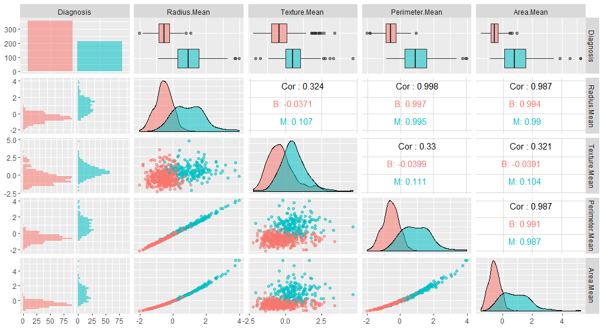
>
>    > ###  Question
>    >
>    > Do you see any differences?
>    >
>    > > ###  Solution
>    > >
>    > > TODO
>    > >
>    > {: .solution}
>    {: .question}
>
{: .hands_on}

## Unsupervised Learning

### Dimensionality Reduction and PCA

**Machine learning** is the science and art of giving computers the ability to learn to make decisions from data without being explicitly programmed.

**Unsupervised learning**, in essence, is the machine learning task of uncovering hidden patterns and structures from **unlabeled data**. For example, a researcher might want to group their samples into distinct groups, based on their gene expression data without in advance what these categories maybe. This is known as **clustering**, one branch of unsupervised learning.

**Supervised learning** (which will be addressed later in depth), is the branch of machine learning that involves **predicting labels**, such as whether a tumor will be benign or malignant.

Another form of unsupervised learning, is dimensionality reduction; in the UCI dataset, for example, there are too many features to keep track of. What if we could reduce the number of features yet still keep much of the information?

Principal component analysis (PCA) is one of the most commonly used methods of dimensionality reduction, and extracts the features with the largest variance. What PCA essentially does is the following:
- The first step of PCA is to decorrelate your data and this corresponds to a linear transformation of the vector space your data lie in;
- The second step is the actual dimension reduction; what is really happening is that your decorrelation step (the first step above) transforms the features into new and uncorrelated features; this second step then chooses the features that contain most of the information about the data.


> ###  Hands-on: Dimensionality Reduction & PCA
>
> 1. Let's have a look into the variables that we currently have, and apply PCA to them. As you can see, we will be using only the numerical variables (i.e. we will exclude the first two, `ID` and `Diagnosis`):
>    ```r
>    ppv_pca <- prcomp(breastCancerData[3:ncol(breastCancerData)], center = TRUE, scale. = TRUE)
>    ```
>
> 2. We can use the `summary()` function to get a summary of the PCA:
>
>    ```r
>    summary(ppv_pca)
>    ```
>
>    The resulting table, shows us the importance of each Principal Component; the standard deviation, the proportion of the variance that it captures, as well as the cumulative proportion of variance capture by the principal components.
>
>    ```
>    Importance of components:
>                              PC1    PC2     PC3     PC4     PC5     PC6     PC7     PC8    PC9
>    Standard deviation     3.6444 2.3857 1.67867 1.40735 1.28403 1.09880 0.82172 0.69037 0.6457
>    Proportion of Variance 0.4427 0.1897 0.09393 0.06602 0.05496 0.04025 0.02251 0.01589 0.0139
>    Cumulative Proportion  0.4427 0.6324 0.72636 0.79239 0.84734 0.88759 0.91010 0.92598 0.9399
>                              PC10   PC11    PC12    PC13    PC14    PC15    PC16    PC17
>    Standard deviation     0.59219 0.5421 0.51104 0.49128 0.39624 0.30681 0.28260 0.24372
>    Proportion of Variance 0.01169 0.0098 0.00871 0.00805 0.00523 0.00314 0.00266 0.00198
>    Cumulative Proportion  0.95157 0.9614 0.97007 0.97812 0.98335 0.98649 0.98915 0.99113
>                              PC18    PC19    PC20   PC21    PC22    PC23   PC24    PC25    PC26
>    Standard deviation     0.22939 0.22244 0.17652 0.1731 0.16565 0.15602 0.1344 0.12442 0.09043
>    Proportion of Variance 0.00175 0.00165 0.00104 0.0010 0.00091 0.00081 0.0006 0.00052 0.00027
>    Cumulative Proportion  0.99288 0.99453 0.99557 0.9966 0.99749 0.99830 0.9989 0.99942 0.99969
>                              PC27    PC28    PC29    PC30
>    Standard deviation     0.08307 0.03987 0.02736 0.01153
>    Proportion of Variance 0.00023 0.00005 0.00002 0.00000
>    Cumulative Proportion  0.99992 0.99997 1.00000 1.00000
>    ```
{: .hands_on}


Principal Components are the underlying structure in the data. They are the directions where there is the most variance, the directions where the data is most spread out. This means that we try to find the straight line that best spreads the data out when it is projected along it. This is the first principal component, the straight line that shows the most substantial variance in the data.

PCA is a type of linear transformation on a given data set that has values for a certain number of variables (coordinates) for a certain amount of spaces. In this way, you transform a set of `x` correlated variables over `y` samples to a set of `p` uncorrelated principal components over the same samples.

Where many variables correlate with one another, they will all contribute strongly to the same principal component. Where your initial variables are strongly correlated with one another, you will be able to approximate most of the complexity in your dataset with just a few principal components. As you add more principal components, you summarize more and more of the original dataset. Adding additional components makes your estimate of the total dataset more accurate, but also more unwieldy.

Every eigenvector has a corresponding eigenvalue. Simply put, an eigenvector is a direction, such as "vertical" or "45 degrees", while an eigenvalue is a number telling you how much variance there is in the data in that direction. The eigenvector with the highest eigenvalue is, therefore, the first principal component. The number of eigenvalues and eigenvectors that exits is equal to the number of dimensions the data set has. In our case, we had 30 variables (32 original, minus the first two), so we have produced 30 eigenvectors / PCs. And we can see that we can address more than 95% of the variance (0.95157) using only the first 10 PCs.

> ###  Hands-on: Deeper look into PCA
>
> 1. We should also have a deeper look in our PCA object:
>
>    ```r
>    str(ppv_pca)
>    ```
>
>    The output should look like this:
>
>    ```
>    List of 5
>     $ sdev    : num [1:30] 3.64 2.39 1.68 1.41 1.28 ...
>     $ rotation: num [1:30, 1:30] -0.219 -0.104 -0.228 -0.221 -0.143 ...
>      ..- attr(*, "dimnames")=List of 2
>      .. ..$ : chr [1:30] "Radius.Mean" "Texture.Mean" "Perimeter.Mean" "Area.Mean" ...
>      .. ..$ : chr [1:30] "PC1" "PC2" "PC3" "PC4" ...
>     $ center  : Named num [1:30] 14.1273 19.2896 91.969 654.8891 0.0964 ...
>      ..- attr(*, "names")= chr [1:30] "Radius.Mean" "Texture.Mean" "Perimeter.Mean" "Area.Mean" ...
>     $ scale   : Named num [1:30] 3.524 4.301 24.299 351.9141 0.0141 ...
>      ..- attr(*, "names")= chr [1:30] "Radius.Mean" "Texture.Mean" "Perimeter.Mean" "Area.Mean" ...
>     $ x       : num [1:569, 1:30] -9.18 -2.39 -5.73 -7.12 -3.93 ...
>      ..- attr(*, "dimnames")=List of 2
>      .. ..$ : NULL
>      .. ..$ : chr [1:30] "PC1" "PC2" "PC3" "PC4" ...
>     - attr(*, "class")= chr "prcomp"
>    ```
>
> 2. The information listed captures the following:
>
>    1. The center point (`$center`), scaling (`$scale`) and the standard deviation(`$sdev`) of each original variable
>    2. The relationship (correlation or anticorrelation, etc) between the initial variables and the principal components (`$rotation`)
>    3. The values of each sample in terms of the principal components (`$x`)
>
>    Let's try to visualize the results we've got so far. We will be using the [`ggbiplot` library](https://github.com/vqv/ggbiplot) for this purpose.
>
>    ```r
>    ggbiplot(ppv_pca, choices=c(1, 2),
>             labels=rownames(breastCancerData),
>             ellipse=TRUE,
>             groups = breastCancerData$Diagnosis,
>             obs.scale = 1,
>             var.axes=TRUE, var.scale = 1) +
>      ggtitle("PCA of Breast Cancer Dataset")+
>      theme_minimal()+
>      theme(legend.position = "bottom")
>    ```
>
>    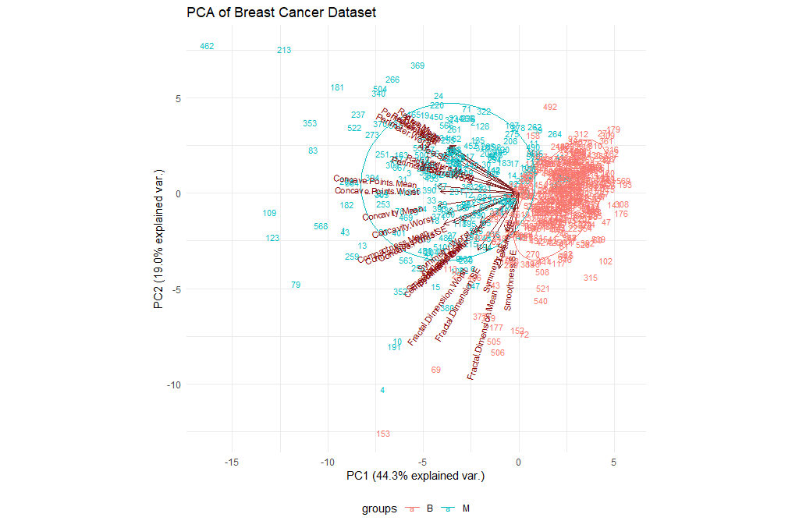
>
{: .hands_on}

> ###  Question
>
> 1. Try changing the parameters of the plot. For example, check the `choices` and the `var.scale`. Is there an impact? What does this mean?
> 2. We have been using the entire table of data. What if we restrict our analysis on the `mean` values (i.e. columns 3-12)? Is there an impact?
>
> > ###  Solution
> >
> > TODO
> >
> {: .solution}
{: .question}

### Clustering

One popular technique in unsupervised learning is clustering. As the name itself suggests, Clustering algorithms group a set of data points into subsets or clusters. The algorithms' goal is to create clusters that are coherent internally, but clearly different from each other externally. In other words, entities within a cluster should be as similar as possible and entities in one cluster should be as dissimilar as possible from entities in another.

Broadly speaking there are two ways of clustering data points based on the algorithmic structure and operation, namely agglomerative and divisive.

- **Agglomerative**: An agglomerative approach begins with each observation in a distinct (singleton) cluster, and successively merges clusters together until a stopping criterion is satisfied.
- **Divisive**: A divisive method begins with all patterns in a single cluster and performs splitting until a stopping criterion is met.

Essentially, this is the task of grouping your data points, based on something about them, such as closeness in space. Clustering is more of a tool to help you explore a dataset, and should not always be used as an automatic method to classify data. Hence, you may not always deploy a clustering algorithm for real-world production scenario. They are often too unreliable, and a single clustering alone will not be able to give you all the information you can extract from a dataset.

### K-Means

What we are going to do is group the tumor data points into two clusters using an algorithm called `k-means`, which aims to cluster the data in order to minimize the variances of the clusters. The basic idea behind k-means clustering consists of defining clusters so that the total intra-cluster variation (known as total within-cluster variation) is minimized. There are several k-means algorithms available. However, the standard algorithm defines the total within-cluster variation as the sum of squared distances Euclidean distances between items and the corresponding centroid:

> ###  Hands-on: Let's cluster our data
>
> 1. Let's cluster our data points (ignoring their know classes) using k-means and then we'll compare the results to the actual labels that we know:
>
>    ```r
>    set.seed(1)
>    km.out <- kmeans(breastCancerData[3:ncol(breastCancerData)], centers=2, nstart=20)
>    ```
>
>    The `nstart` option attempts multiple initial configurations and reports on the best one within the kmeans function. Seeds allow us to create a starting point for randomly generated numbers, so that each time our code is run, the same answer is generated.
>    Also, note that k-means requires the number of clusters to be defined beforehand and given via the `centers` option.
>
> 2. Let's check now what the output contains:
>
>    ```r
>    str(km.out)
>    ```
>
>    The output will be:
>
>    ```
>    List of 9
>     $ cluster     : int [1:569] 2 2 2 1 2 1 2 1 1 1 ...
>     $ centers     : num [1:2, 1:30] 12.6 19.4 18.6 21.7 81.1 ...
>      ..- attr(*, "dimnames")=List of 2
>      .. ..$ : chr [1:2] "1" "2"
>      .. ..$ : chr [1:30] "Radius.Mean" "Texture.Mean" "Perimeter.Mean" "Area.Mean" ...
>     $ totss       : num 2.57e+08
>     $ withinss    : num [1:2] 28559677 49383423
>     $ tot.withinss: num 77943100
>     $ betweenss   : num 1.79e+08
>     $ size        : int [1:2] 438 131
>     $ iter        : int 1
>     $ ifault      : int 0
>     - attr(*, "class")= chr "kmeans"
>    ```
>
>    The information contained here is:
>    - `$cluster`: a vector of integers (from 1:k) indicating the cluster to which each point is allocated.
>    - `$centers`: a matrix of cluster centers.
>    - `$withinss`: vector of within-cluster sum of squares, one component per cluster.
>    - `$tot.withinss`: total within-cluster sum of squares (i.e. `sum(withinss)`).
>    - `$size`: the number of points in each cluster.
>
> 3. Let's have a look at the clusters, and we will do this in relationship to the principal components we identified earlier:
>
>    ```r
>    ggplot(as.data.frame(ppv_pca$x), aes(x=PC1, y=PC2, color=as.factor(km.out$cluster), shape = breastCancerData$Diagnosis)) +
>      geom_point( alpha = 0.6, size = 3) +
>      theme_minimal()+
>      theme(legend.position = "bottom") +
>      labs(title = "K-Means clusters against PCA", x = "PC1", y = "PC2", color = "Cluster", shape = "Diagnosis")
>    ```
>
>    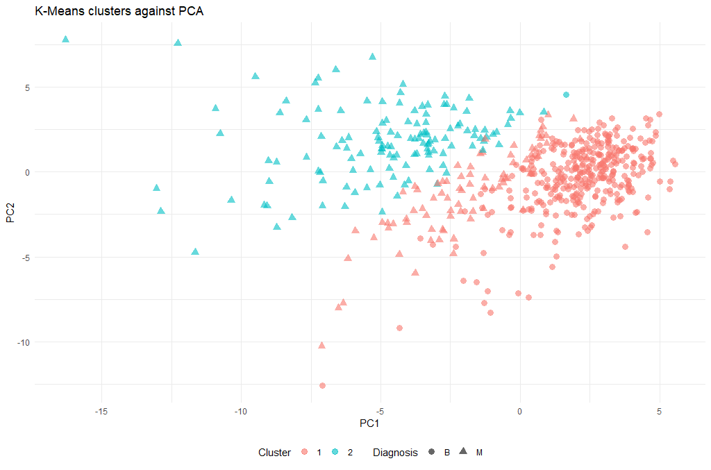
>
>    This is a rather complex plotting command that is based on the `ggplot` library. For an overview of how `ggplot` works, have a look at the [RNA Seq Counts to Viz in R](https://training.galaxyproject.org/training-material/topics/transcriptomics/tutorials/rna-seq-counts-to-viz-in-r/tutorial.html) tutorial.
>
> 4. Now that we have a cluster for each tumor (clusters 1 and 2), we can check how well they coincide with the labels that we know. To do this we will use a cool method called **cross-tabulation**: a cross-tab is a table that allows you to read off how many data points in clusters 1 and 2 were actually benign or malignant respectively.
>
>    ```r
>    # Cross-tab of clustering & known labels
>    library(gmodels)
>    CrossTable(breastCancerData$Diagnosis, km.out$cluster)
>    ```
>
>    The output should look like this:
>
>    ```
>    Cell Contents
>    |-------------------------|
>    |                       N |
>    | Chi-square contribution |
>    |           N / Row Total |
>    |           N / Col Total |
>    |         N / Table Total |
>    |-------------------------|
>
>
>    Total Observations in Table:  569
>
>
>                               | km.out$cluster
>    breastCancerData$Diagnosis |         1 |         2 | Row Total |
>    ---------------------------|-----------|-----------|-----------|
>                             B |       356 |         1 |       357 |
>                               |    23.988 |    80.204 |           |
>                               |     0.997 |     0.003 |     0.627 |
>                               |     0.813 |     0.008 |           |
>                               |     0.626 |     0.002 |           |
>    ---------------------------|-----------|-----------|-----------|
>                             M |        82 |       130 |       212 |
>                               |    40.395 |   135.060 |           |
>                               |     0.387 |     0.613 |     0.373 |
>                               |     0.187 |     0.992 |           |
>                               |     0.144 |     0.228 |           |
>    ---------------------------|-----------|-----------|-----------|
>                  Column Total |       438 |       131 |       569 |
>                               |     0.770 |     0.230 |           |
>    ---------------------------|-----------|-----------|-----------|
>    ```
>
>    _Question: **How well did the clustering work?**_
>
{: .hands_on}

#### Optimal k

One technique to choose the best `k` is called the **elbow method**. This method uses within-group homogeneity or within-group heterogeneity to evaluate the variability. In other words, you are interested in the percentage of the variance explained by each cluster. You can expect the variability to increase with the number of clusters, alternatively, heterogeneity decreases. Our challenge is to find the `k` that is beyond the diminishing returns. Adding a new cluster does not improve the variability in the data because very few information is left to explain.

> ###  Hands-on: Finding the optimal k
>
> 1. First of all, let's create a function that computes the total within clusters sum of squares:
>
>    ```r
>    kmean_withinss <- function(k) {
>      cluster <- kmeans(breastCancerData[3:ncol(breastCancerData)], k)
>      return (cluster$tot.withinss)
>    }
>    ```
>
> 2. We can try for a single `k` (e.g. 2), and see the value:
>
>    ```r
>    kmean_withinss(2)
>    ```
>
>    ```
>    [1] 77943100
>    ```
>
> 3. However, we need to test this `n` times. We will use the `sapply()` function to run the algorithm over a range of `k`. This technique is faster than creating a loop and store the value each time.
>
>    ```r
>    # Set maximum cluster
>    max_k <-20
>    # Run algorithm over a range of k
>    wss <- sapply(2:max_k, kmean_withinss)
>    ```
>
> 4. Finally, let's save the results into a data frame, so that we can work with it:
>
>    ```r
>    # Create a data frame to plot the graph
>    elbow <-data.frame(2:max_k, wss)
>    ```
>
> 5. Now that we have the data, we can plot them and try to identify the "elbow" point:
>
>    ```r
>    # Plot the graph with gglop
>    ggplot(elbow, aes(x = X2.max_k, y = wss)) +
>      geom_point() +
>      geom_line() +
>      scale_x_continuous(breaks = seq(1, 20, by = 1))
>    ```
>
>    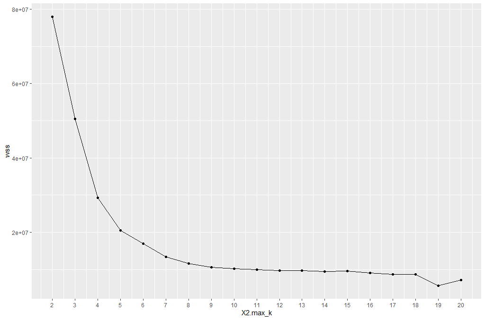
>
>    > ###  Question
>    >
>    > What is the optimal `k` value?
>    >
>    > > ###  Solution
>    > >
>    > > From the graph, you can see the optimal `k` is around 10, where the curve is starting to have a diminishing return.
>    > >
>    > {: .solution}
>    {: .question}
>
{: .hands_on}

> ###  Question
>
> 1. Try re-running the clustering step with the new k. Is there a significant difference?
> 2. Try to think of alternative metrics that could be used as a "distance" measure, instead of the default "Euclidean". Do you think there might be an optimal for our case?
>
> > ###  Solution
> >
> > TODO
> >
> {: .solution}
{: .question}

### Hierarchical clustering

k-means clustering requires us to specify the number of clusters, and determining the optimal number of clusters is often not trivial. Hierarchical clustering is an alternative approach which builds a hierarchy from the bottom-up, and doesn’t require us to specify the number of clusters beforehand but requires extra steps to extract final clusters.
The algorithm works as follows:

- Put each data point in its own cluster.
- Identify the closest two clusters and combine them into one cluster.
- Repeat the above step till all the data points are in a single cluster.

Once this is done, it is usually represented by a dendrogram like structure. There are a few ways to determine how close two clusters are:

1. **Complete linkage clustering**: Find the maximum possible distance between points belonging to two different clusters.
2. **Single linkage clustering**: Find the minimum possible distance between points belonging to two different clusters.
3. **Mean linkage clustering**: Find all possible pairwise distances for points belonging to two different clusters and then calculate the average.
4. **Centroid linkage clustering**: Find the centroid of each cluster and calculate the distance between centroids of two clusters.


> ###  Hands-on: k-means Clustering
> 1. We will be applying Hierarchical clustering to our dataset, and see what the result might be. Remember that our dataset has some columns with nominal (categorical) values (columns `ID` and `Diagnosis`), so we will need to make sure we only use the columns with numerical values. There are no missing values in this dataset that we need to clean before clustering. But the scales of the features are different and we need to normalize it.
>
>    ```r
>    breastCancerDataScaled <- as.data.frame(scale(breastCancerData[3:ncol(breastCancerData)]))
>    summary(breastCancerDataScaled)
>    ```
>
> 2. We can now proceed with creating the distance matrix:
>
>    ```r
>    dist_mat <- dist(breastCancerDataScaled, method = 'euclidean')
>    ```
>
>    There are several options for `method`: `euclidean`, `maximum`, `manhattan`, `canberra`, `binary` or `minkowski`.
>
> 3. The next step is to actually perform the hierarchical clustering, which means that at this point we should decide which linkage method we want to use. We can try all kinds of linkage methods and later decide on which one performed better. Here we will proceed with `average` linkage method (i.e. UPGMA); other methods include `ward.D`, `ward.D2`, `single`, `complete`, `mcquitty` (= WPGMA), `median` (= WPGMC) and `centroid` (= UPGMC).
>
>    ```r
>    hclust_avg <- hclust(dist_mat, method = 'average')
>
>    plot(hclust_avg)
>    ```
>
>    ")
>
>    Notice how the dendrogram is built and every data point finally merges into a single cluster with the height(distance) shown on the y-axis.
>
> 4. Next, we can cut the dendrogram in order to create the desired number of clusters. In our case, we might want to check whether our two groups (`M` and `B`) can be identified as sub-trees of our clustering - so we'll set `k = 2` and then plot the result.
>
>    ```r
>    cut_avg <- cutree(hclust_avg, k = 2)
>
>    plot(hclust_avg, labels = breastCancerData$ID, hang = -1, cex = 0.2,
>         main = "Cluster dendrogram (k = 2)", xlab = "Breast Cancer ID", ylab = "Height")
>    # k: Cut the dendrogram such that exactly k clusters are produced
>    # border: Vector with border colors for the rectangles. Coild also be a number vector 1:2
>    # which: A vector selecting the clusters around which a rectangle should be drawn (numbered from left to right)
>    rect.hclust(hclust_avg , k = 2, border = c("red","green"), which = c(1, 2))
>    # Draw a line at the height that the cut takes place
>    abline(h = 18, col = 'red', lwd=3, lty=2)
>    ```
>    ")
>
> 5. Now we can see the two clusters enclosed in two different colored boxes. We can also use the `color_branches()` function from the `dendextend` library to visualize our tree with different colored branches.
>
>    ```r
>    library(dendextend)
>    avg_dend_obj <- as.dendrogram(hclust_avg)
>    # We can use either k (number of clusters), or clusters (and specify the cluster type)
>    avg_col_dend <- color_branches(avg_dend_obj, k = 2, groupLabels=TRUE)
>    plot(avg_col_dend, main = "Cluster dendrogram with color per cluster (k = 2)", xlab = "Breast Cancer ID", ylab = "Height")
>    ```
>
>    ")
>
> 6. We can change the way branches are colored, to reflect the `Diagnosis` value:
>
>    ```r
>    avg_col_dend <- color_branches(avg_dend_obj, clusters = breastCancerData$Diagnosis)
>    plot(avg_col_dend, main = "Cluster dendrogram with Diagnosis color", xlab = "Breast Cancer ID", ylab = "Height")
>    ```
>
>    ")
>
> 7. TODO? Step Title
>
>    ```r
>    ggplot(as.data.frame(ppv_pca$x), aes(x=PC1, y=PC2, color=as.factor(cut_avg), shape = breastCancerData$Diagnosis)) +
>      geom_point( alpha = 0.6, size = 3) +
>      theme_minimal()+
>      theme(legend.position = "bottom") +
>      labs(title = "Hierarchical clustering (cut at k=2) against PCA", x = "PC1", y = "PC2", color = "Cluster", shape = "Diagnosis")
>    ```
>
>     results against the first two PCs on the UCI Breast Cancer dataset")
>
{: .hands_on}


> ###  Question
>
> 1. The hierarchical clustering performed so far, only used two methods: `euclidean` and `average`. Try experimenting with different methods. Do the final results improve?
> 2. Obviously the cut-off selection (k=2) was not optimal. Try using different cut-offs to ensure that the final clustering could provide some context to the original question.
>
> > ###  Solution
> >
> > TODO
> >
> {: .solution}
{: .question}

# Supervised Learning

Supervised learning is the branch of Machine Learning (ML) that involves predicting labels, such as 'Survived' or 'Not'. Such models learn from labelled data, which is data that includes whether a passenger survived (called "model training"), and then predict on unlabeled data.

These are generally called train and test sets because
- You want to build a model that learns patterns in the training set, and
- You then use the model to make predictions on the test set.

We can then calculate the percentage that you got correct: this is known as the accuracy of your model.

## How To Start with Supervised Learning

As you might already know, a good way to approach supervised learning is the following:
- Perform an Exploratory Data Analysis (EDA) on your data set;
- Build a quick and dirty model, or a baseline model, which can serve as a comparison against later models that you will build;
- Iterate this process. You will do more EDA and build another model;
- Engineer features: take the features that you already have and combine them or extract more information from them to eventually come to the last point, which is
- Get a model that performs better.

A common practice in all supervised learning is the construction and use of the **train- and test- datasets**. This process takes all of the input randomly splits into the two datasets (training and test); the ratio of the split is usually up to the researcher, and can be anything: 80/20, 70/30, 60/40...

## Supervised Learning I: classification

There are various classifiers available:

- **Decision Trees** – These are organized in the form of sets of questions and answers in the tree structure.
- **Naive Bayes Classifiers** – A probabilistic machine learning model that is used for classification.
- **K-NN Classifiers** – Based on the similarity measures like distance, it classifies new cases.
- **Support Vector Machines** – It is a non-probabilistic binary classifier that builds a model to classify a case into one of the two categories. They rely on a `kernel` function that essentially projects the data points to higher-dimensional space; depending on this new space, there can be both linear and non-linear SVMs.

### Decision trees

It is a type of supervised learning algorithm. We use it for classification problems. It works for both types of input and output variables. In this technique, we split the population into two or more homogeneous sets. Moreover, it is based on the most significant splitter/differentiator in input variables.

The Decision Tree is a powerful non-linear classifier. A Decision Tree makes use of a tree-like structure to generate relationship among the various features and potential outcomes. It makes use of branching decisions as its core structure.

There are two types of decision trees:
- **Categorical (classification)** Variable Decision Tree: Decision Tree which has a categorical target variable.
- **Continuous (Regression)** Variable Decision Tree: Decision Tree has a continuous target variable.

Regression trees are used when the dependent variable is continuous while classification trees are used when the dependent variable is categorical. In continuous, a value obtained is a mean response of observation. In classification, a value obtained by a terminal node is a mode of observations.


> ###  Hands-on: Decision Trees
> 1. Here, we will use the `rpart` and the `rpart.plot` package in order to produce and visualize a decision tree. First of all, we'll create the train and test datasets using a 70/30 ratio and a fixed seed so that we can reproduce the results.
>
>    ```r
>    # split into training and test subsets
>    set.seed(1000)
>    ind <- sample(2, nrow(breastCancerData), replace=TRUE, prob=c(0.7, 0.3))
>    breastCancerData.train <- breastCancerDataNoID[ind==1,]
>    breastCancerData.test <- breastCancerDataNoID[ind==2,]
>    ```
>
> 2. Now, we will load the library and create our model. We would like to create a model that predicts the `Diagnosis` based on the mean of the radius and the area, as well as the SE of the texture. For ths reason we'll use the notation of `myFormula <- Diagnosis ~ Radius.Mean + Area.Mean + Texture.SE`. If we wanted to create a prediction model based on all variables, we will have used `myFormula <- Diagnosis ~ .` instead. Finally, `minsplit` stands for the the minimum number of instances in a node so that it is split.
>
>    ```r
>    library(rpart)
>    library(rpart.plot)
>    myFormula <- Diagnosis ~ Radius.Mean + Area.Mean + Texture.SE
>
>    breastCancerData.model <- rpart(myFormula,
>                                    method = "class",
>                                    data = breastCancerData.train,
>                                    minsplit = 10,
>                                    minbucket = 1,
>                                    maxdepth = 3,
>                                    cp = -1)
>
>    print(breastCancerData.model$cptable)
>    rpart.plot(breastCancerData.model)
>    ```
>
> 3. We see the following output and a figure:
>
>    ```
>          CP       nsplit rel error   xerror     xstd
>    1  0.69930070      0 1.0000000 1.0000000 0.06688883
>    2  0.02797203      1 0.3006993 0.3006993 0.04330166
>    3  0.00000000      2 0.2727273 0.3006993 0.04330166
>    4 -1.00000000      6 0.2727273 0.3006993 0.04330166
>    ```
>
>    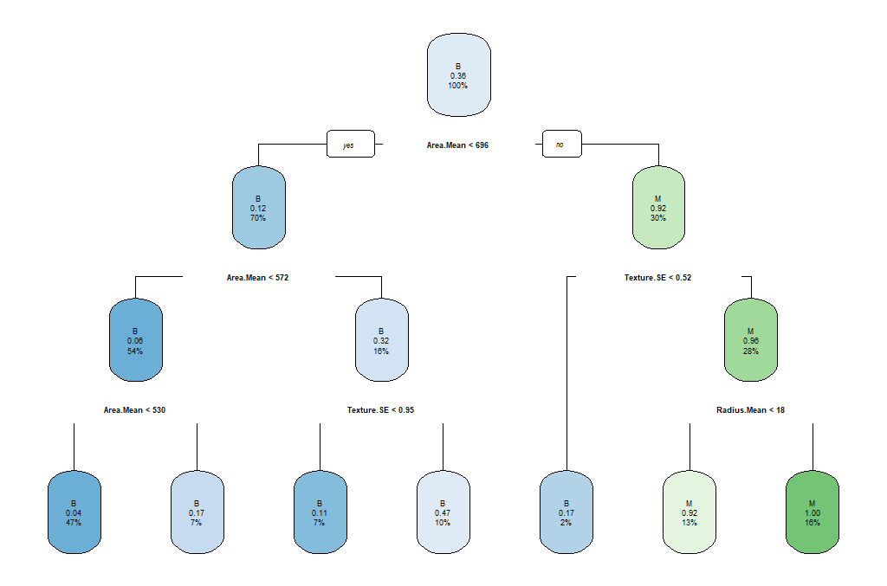
>
>    The parameters that we used reflect the following aspects of the model:
>    - `minsplit`: the minimum number of instances in a node so that it is split
>    - `minbucket`: the minimum allowed number of instances in each leaf of the tree
>    - `maxdepth`: the maximum depth of the tree
>    - `cp`: parameter that controls the complexity for a split and is set intuitively (the larger its value, the more probable to apply pruning to the tree)
>
> 4. As we can observe, this might not be the best model. So we can select the tree with the minimum prediction error:
>
>    ```r
>    opt <- which.min(breastCancerData.model$cptable[, "xerror"])
>    cp <- breastCancerData.model$cptable[opt, "CP"]
>    # prune tree
>    breastCancerData.pruned.model <- prune(breastCancerData.model, cp = cp)
>    # plot tree
>    rpart.plot(breastCancerData.pruned.model)
>
>    table(predict(breastCancerData.pruned.model, type="class"), breastCancerData.train$Diagnosis)
>    ```
>
>    The output now is the following Confusion Matrix and pruned tree:
>
>    ```
>        B    M
>    B  245  34
>    M   9   109
>    ```
>
>    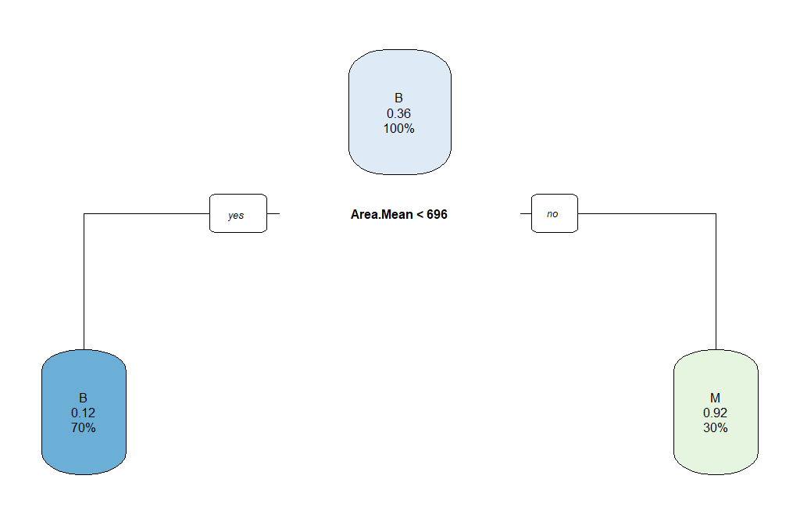
>
>    > ###  Question
>    >
>    > What does the above "Confusion Matrix" tells you?
>    >
>    > > ###  Solution
>    > >
>    > > TODO
>    > >
>    > {: .solution}
>    {: .question}
>
> 5. Now that we have a model, we should check how the prediction works in our test dataset.
>
>
>    ```r
>    ## make prediction
>    BreastCancer_pred <- predict(breastCancerData.pruned.model, newdata = breastCancerData.test, type="class")
>    plot(BreastCancer_pred ~ Diagnosis, data = breastCancerData.test,
>         xlab = "Observed",
>         ylab = "Prediction")
>    table(BreastCancer_pred, breastCancerData.test$Diagnosis)
>    ```
>
>    The new Confusion Matrix is the following:
>
>    ```
>    BreastCancer_pred   B   M
>                    B 102  16
>                    M   1  53
>    ```
>
>    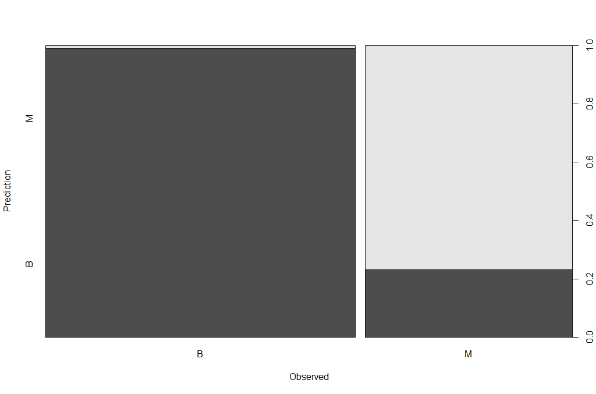
{: .hands_on}

> ###  Question
>
> 1. Can we improve the above model? What are the key parameters that have the most impact?
> 2. We have been using only some of the variables in our model. What is the impact of using all variables / features for our prediction? Is this a good or a bad plan?
>
> > ###  Solution
> >
> > TODO
> >
> {: .solution}
{: .question}

### Random Forests

Random Forests is an ensemble learning technique, which essentially constructs multiple decision trees. Each tree is trained with a random sample of the training dataset and on a randomly chosen subspace. The final prediction result is derived from the predictions of all individual trees, with mean (for regression) or majority voting (for classification). The advantage is that it has better performance and is less likely to overfit than a single decision tree; however it has lower interpretability.

There are two main libraries in R that provide the functionality for Random Forest creation; the `randomForest` and the `party: cforest()`.

Package `randomForest`
- very fast
- cannot handle data with missing values
- a limit of 32 to the maximum number of levels of each categorical attribute
- extensions: extendedForest, gradientForest

Package `party: cforest()`
- not limited to the above maximum levels
- slow
- needs more memory

In this exercise, we will be using the `randomForest`.

> ###  Hands-on: Random Forests
> 1. First, let's train the model:
>
>    ```r
>    library(randomForest)
>    set.seed(1000)
>    rf <- randomForest(Diagnosis ~ ., data = breastCancerData.train,
>                       ntree=100,
>                       proximity=T)
>
>    table(predict(rf), breastCancerData.train$Diagnosis)
>    ```
>
>    The output is the following:
>
>    ```
>       B   M
>    B 249  12
>    M   5 131
>    ```
>
> 2. We can also investigate the content of the model:
>
>    ```r
>    print(rf)
>    ```
>
>    The output shows the individual components and internal parameters of the Random Forest model.
>
>    ```
>    Call:
>     randomForest(formula = Diagnosis ~ ., data = breastCancerData.train,      ntree = 100, proximity = T)
>                   Type of random forest: classification
>                         Number of trees: 100
>    No. of variables tried at each split: 5
>
>            OOB estimate of  error rate: 4.28%
>    Confusion matrix:
>        B   M class.error
>    B 249   5  0.01968504
>    M  12 131  0.08391608
>    ```
>
> 3. We can view the overall performance of the model here:
>
>    ```r
>    plot(rf, main = "")
>    ```
>
>    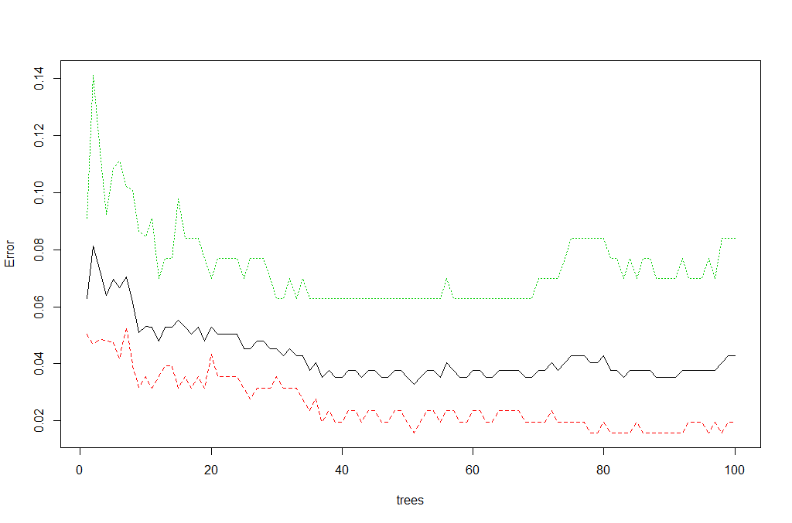
>
> 4. We can also review which of the variables has the highest "importance" (i.e. impact to the performance of the model):
>
>    ```r
>    importance(rf)
>
>    varImpPlot(rf)
>    ```
>
>    The output is the table and the figure below:
>
>    ```
>    ID                             1.0244803
>    Radius.Mean                    7.8983552
>    Texture.Mean                   1.9614134
>    Perimeter.Mean                 9.3502914
>    Area.Mean                      7.3438007
>    Smoothness.Mean                0.7228277
>    Compactness.Mean               2.6595043
>    Concavity.Mean                11.2341661
>    Concave.Points.Mean           18.5940046
>    Symmetry.Mean                  0.8989458
>    Fractal.Dimension.Mean         0.7465322
>    Radius.SE                      3.1941672
>    Texture.SE                     0.6363906
>    Perimeter.SE                   2.4672730
>    Area.SE                        5.3446273
>    Smoothness.SE                  0.6089522
>    Compactness.SE                 0.7785777
>    Concavity.SE                   0.5576146
>    Concave.Points.SE              1.0314107
>    Symmetry.SE                    0.8839428
>    Fractal.Dimension.SE           0.6475348
>    Radius.Worst                  18.2035365
>    Texture.Worst                  3.2765864
>    Perimeter.Worst               25.3605679
>    Area.Worst                    17.1063000
>    Smoothness.Worst               2.1677456
>    Compactness.Worst              2.9489506
>    Concavity.Worst                6.0009637
>    Concave.Points.Worst          25.6081497
>    Symmetry.Worst                 2.1507714
>    Fractal.Dimension.Worst        1.1498020
>    ```
>
>    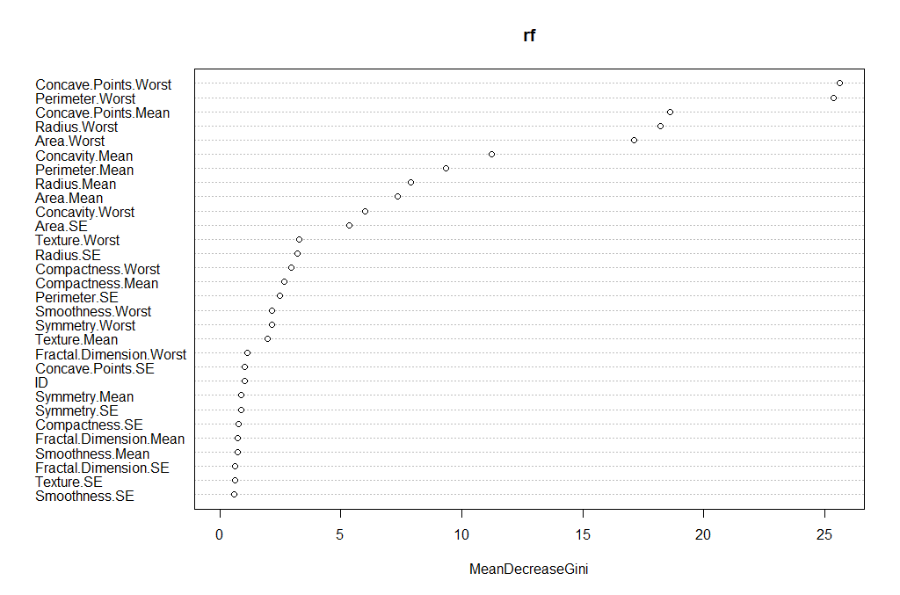
>
> 5. Let's try to do a prediction of the `Diagnosis` for the test set, using the new model. The margin of a data point is as the proportion of votes for the correct class minus maximum proportion of votes for other classes. Positive margin means correct classification.
>
>    ```r
>    BreastCancer_pred_RD <- predict(rf, newdata = breastCancerData.test)
>    table(BreastCancer_pred_RD, breastCancerData.test$Diagnosis)
>
>    plot(margin(rf, breastCancerData.test$Diagnosis))
>    ```
>
>    The output is the table and figure below:
>
>    ```
>    BreastCancer_pred_RD   B   M
>                       B 101   6
>                       M   2  63
>    ```
>
>    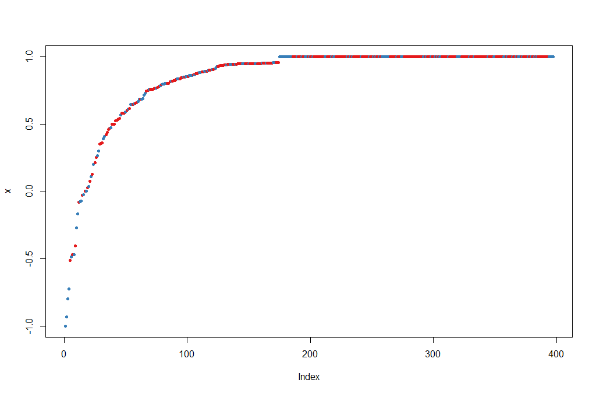
>
> 6. Feature selection: We can evaluate the prediction performance of models with reduced numbers of variables that are ranked by their importance.
>
>    ```r
>    result <- rfcv(breastCancerData.train, breastCancerData.train$Diagnosis, cv.fold=3)
>    with(result, plot(n.var, error.cv, log="x", type="o", lwd=2))
>    ```
>
>    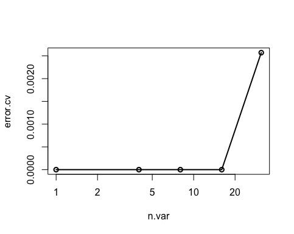
>
{: .hands_on}


## Supervised Learning II: regression

### Linear regression


Linear regression is to predict response with a linear function of predictors. The most common function in R for this is `lm`. In our dataset, let's try to investigate the relationship between `Radius.Mean`, `Concave.Points.Mean` and `Area.Mean`.

> ###  Hands-on: Linear Regression
> 1. We can get a first impression by looking at the correlation of these variables:
>
>    ```r
>    ## correlation between Radius.Mean and Concave.Points.Mean / Area.Mean
>    cor(breastCancerData$Radius.Mean, breastCancerData$Concave.Points.Mean)
>    ## [1] 0.8225285
>    cor(breastCancerData$Concave.Points.Mean, breastCancerData$Area.Mean)
>    ## [1] 0.8232689
>    ```
>
> 2. Lets create a short version of our data
>    ```r
>    bc <- select(breastCancerData,Radius.Mean,Concave.Points.Mean,Area.Mean)
>    ```
>
>
> 3. Let's build now a linear regression model with function `lm()` on the whole dataset:
>
>    ```r
>    bc_model_full <- lm(Radius.Mean ~ Concave.Points.Mean + Area.Mean, data=bc)
>    bc_model_full
>    ```
>
>    The output is the following:
>
>    ```
>    Call:
>    lm(formula = Radius.Mean ~ ., data = bc)
>
>    Coefficients:
>            (Intercept)  Concave.Points.Mean            Area.Mean
>                7.68087              2.72493              0.00964
>    ```
>
>    This tells us what are the coefficients of `Concave.Points.Mean` and `Area.Mean`, in the linear equation that connects them to `Radius.Mean`. Let's see if we can predict now the mean radius of a new sample, with `Concave.Points.Mean` = 2.724931 and `Area.Mean` = 0.00964.
>
> 4. Let's make predictions on our training dataset and visualize
>    ```r
>    preds <- predict(bc_model_full)
>
>    plot(preds, bc$Radius.Mean, xlab = "Prediction", ylab = "Observed")
>    abline(a = 0, b = 1)
>    ```
>    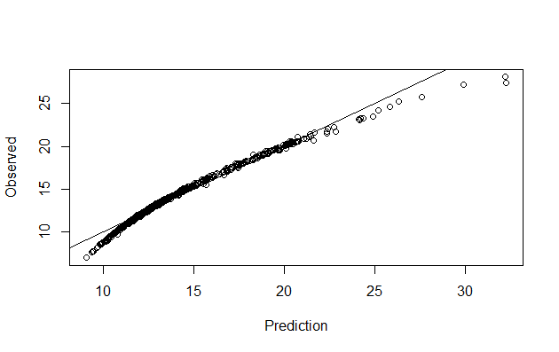
>
> 5. We can also have a better look at what the model contains with `summary(bc_model_full)`:
>
>    ```
>    Call:
>    lm(formula = Radius.Mean ~ ., data = bc)
>
>    Residuals:
>        Min      1Q  Median      3Q     Max
>    -4.8307 -0.1827  0.1497  0.3608  0.7411
>
>    Coefficients:
>                         Estimate Std. Error t value Pr(>|t|)
>    (Intercept)         7.6808702  0.0505533 151.936   <2e-16 ***
>    Concave.Points.Mean 2.7249328  1.0598070   2.571   0.0104 *
>    Area.Mean           0.0096400  0.0001169  82.494   <2e-16 ***
>    ---
>    Signif. codes:  0 ‘***’ 0.001 ‘**’ 0.01 ‘*’ 0.05 ‘.’ 0.1 ‘ ’ 1
>
>    Residual standard error: 0.5563 on 566 degrees of freedom
>    Multiple R-squared:  0.9752,	Adjusted R-squared:  0.9751
>    F-statistic: 1.111e+04 on 2 and 566 DF,  p-value: < 2.2e-16
>    ```
>
> 6. But his only provides the evaluation on the whole dataset that we sued for training. we don't know how it will perform on unknown dataset. So, let's split our dataset into training and test set, create the model on training set and visualize the predictions
>
>
>    ```r
>    set.seed(123)
>    ind <- sample(2, nrow(bc), replace=TRUE, prob=c(0.75, 0.25))
>    bc_train <- bc[ind==1,]
>    bc_test <- bc[ind==2,]
>
>
>    #Let's build now a linear regression model using the training data and print it:
>    (bc_model <- lm(Radius.Mean ~ Concave.Points.Mean + Area.Mean, data=bc_train))
>
>    #We can also view the model's summary
>    summary(bc_model)
>
>
>    ######Evaluating graphically
>    #Let's make predictions on our training dataset and store the predictions as a new column
>    bc_train$pred <- predict(bc_model)
>
>    # plot the ground truths vs predictions for training set
>    ggplot(bc_train, aes(x = pred, y = Radius.Mean)) +
>      geom_point() +
>      geom_abline(color = "blue")
>    ```
>    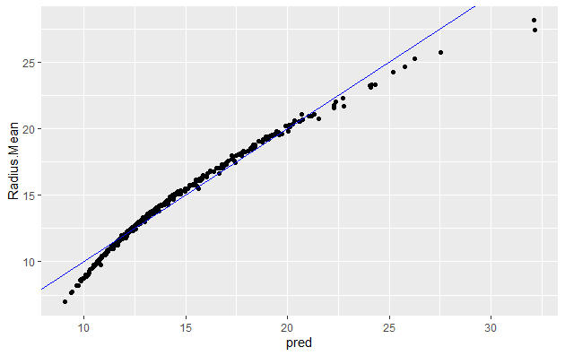
>
>    You will note that it is quite similar to when using whole dataset
>
> 7. Let's predict using test data
>    ```R
>    bc_test$pred <- predict(bc_model , newdata=bc_test)
>    ```
>
> 8. and plot
>
>    ```r
>    # plot the ground truths vs predictions for test set and examine the plot. Does it look as good with the predictions on the training set?
>    ggplot(bc_test, aes(x = pred, y = Radius.Mean)) +
>      geom_point() +
>      geom_abline(color = "blue")
>    ```
>
{: .hands_on}


Now let's use the RMSE and the R_square metrics to evaluate our model on the training and test set. R_square measures how much of variability in dependent variable can be explained by the model. It is defined as the square of the correlation coefficient (`R`), and that is why it is called "R Square" (more info [here](https://en.wikipedia.org/wiki/Coefficient_of_determination)).


> ###  Question
>
> Try evaluating model using RMSE, but on the training set this time
>
> > ###  Solution
> >
> > ```r
> > ##### Answer to exercise 1.
> > #Calculate residuals
> > res <- bc_train$Radius.Mean-bc_train$pred
> > #For training data we can also obtain the residuals using the bc_model$residuals
> >
> > # Calculate RMSE, assign it to the variable rmse and print it
> > (rmse <- sqrt(mean(res^2)))
> > [1] 0.5624438
> >
> > # Calculate the standard deviation of actual outcome and print it
> > (sd_bc_train <- sd(bc_train$Radius.Mean))
> > [1] 3.494182
> > ```
> >
> > So we can see that our RMSE is very small compared to SD, hence it is a good model
> >
> {: .solution}
{: .question}

> ###  Question
>
> 1. Calculate RMSE for the test data and check if the model is not overfit.
> 2. Evaluating model using R_square - on training set.
> 3. Calculate R_square for the test data and check if the model is not overfit.
>
> > ###  Solution
> >
> > TODO
> >
> {: .solution}
{: .question}

```r
# Calculate mean of outcome: bc_mean.
bc_mean <- mean(bc_train$Radius.Mean)

# Calculate total sum of squares: tss.
tss <- sum((bc_train$Radius.Mean - bc_mean)^2)

# Calculate residual sum of squares: rss.
err <- bc_train$Radius.Mean-bc_train$pred
rss <- sum(err^2)

# Calculate R-squared: rsq. Print it. Is it a good fit?
(rsq <- 1-(rss/tss))
[1] 0.974028
```

This again confirms that our model is very good as the R_square value is very close to 1


# Conclusion

With the rise in high-throughput sequencing technologies, the volume of omics data has grown exponentially in recent times and a major issue is to mine useful knowledge from these data which are also heterogeneous in nature. Machine learning (ML) is a discipline in which computers perform automated learning without being programmed explicitly and assist humans to make sense of large and complex data sets. The analysis of complex high-volume data is not trivial and classical tools cannot be used to explore their full potential. Machine learning can thus be very useful in mining large omics datasets to uncover new insights that can advance the field of bioinformatics.

This tutorial was only a first introductory step into the main concepts and approaches in machine learning. We looked at some of the common methods being used to analyse a representative dataset, by providing a practical context through the use of basic but widely used R libraries. Hopefully, at this point, you will have acquired a first understanding of the standard ML processes, as well as the practical skills in applying them on familiar problems and publicly available real-world data sets.

{:.no_toc}
